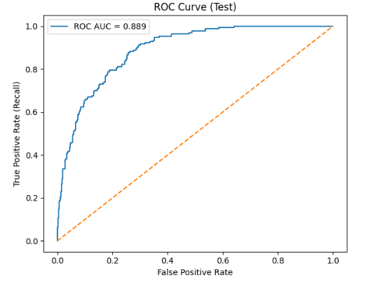
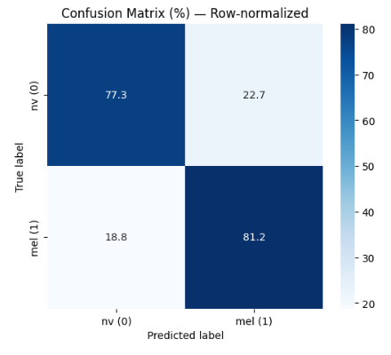

# Skin Lesion Classification using Handcrafted Features and SVM

Feature-based dermoscopic skin lesion classification using classical computer vision techniques and Support Vector Machines (SVM), evaluated across HAM10000 and ISIC-2019 datasets.

---

## Overview

This project implements a complete feature-engineering pipeline for dermoscopic image classification.  
Instead of deep learning, the approach focuses on handcrafted descriptors and classical ML to study:

- Robustness under dataset shift  
- Cross-dataset generalization  
- Threshold calibration and decision trade-offs  

The model is trained on HAM10000 and evaluated on both HAM10000 and ISIC-2019 to assess generalization performance.

---

## Methodology

### 1️ Preprocessing
- Hair artifact removal
- Color normalization
- Image resizing
- Lesion segmentation

### 2️ Feature Extraction
- Color statistics
- Texture descriptors
- Shape features
- Intensity-based statistics

### 3 Classification
- Support Vector Machine (RBF kernel)
- Class imbalance handling
- Hyperparameter tuning (GridSearch)

---

## Evaluation Metrics

- ROC-AUC
- Precision-Recall AUC
- Confusion Matrix
- Threshold sweep analysis
- Learning curves

---

## Results

### HAM10000

- ROC-AUC ≈ 0.889
- PR-AUC ≈ 0.596

### Cross-Dataset Evaluation (ISIC-2019)

Performance degradation observed under dataset shift, highlighting domain generalization challenges.

---

## Repository Structure

skin-lesion-classification-svm/
│
├── results/
│ ├── ham10000/
│ └── isic2019/
│
├── skin_lesion_classification.ipynb
├── requirements.txt
└── .gitignore


---

## 📊 Sample Results

### ROC Curve (HAM10000)



### Confusion Matrix (HAM10000)



---

## ⚙️ Installation

```bash
pip install -r requirements.txt


